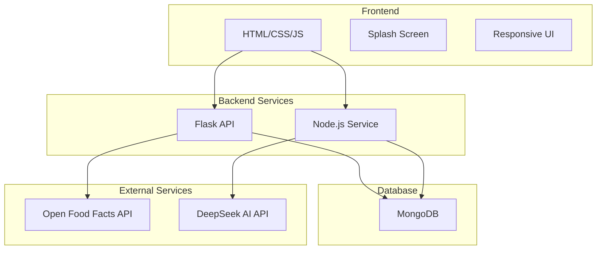

# 🍊 GrocerStock: Smart Inventory Manager

A dynamic, full-stack application for managing grocery and vegetable inventory with automated data entry and barcode functionality.

## 🚀 Features

### Core Features
- **Barcode Scanning**: Utilize device camera to scan product barcodes with Open Food Facts API integration
- **Manual Product Entry**: Comprehensive form for products without barcodes
- **Expiry Date Tracking**: Essential expiry date management for all inventory items
- **Custom Barcode Generation**: Create barcodes for non-barcoded items (produce, homemade goods)
- **Real-time Updates**: Live inventory synchronization across devices
- **Smart Categorization**: AI-powered product organization using DeepSeek API
- **Responsive Design**: Mobile-first approach with vibrant orange theme

### Technical Highlights
- **Full-Stack Architecture**: Flask backend + Node.js real-time service + MongoDB
- **Modern UI/UX**: Smooth animations, micro-interactions, and vibrant design
- **Docker Containerization**: Easy deployment with Docker Compose
- **RESTful APIs**: Clean, documented API endpoints
- **WebSocket Integration**: Real-time inventory updates
- **External API Integration**: Open Food Facts for product data

## 🏗️ Architecture



## 📋 Quick Start

### Prerequisites
- Docker and Docker Compose
- (Optional) Node.js and Python for development

### Installation
1. **Clone and setup:**
   ```bash
   git clone <repository-url>
   cd grocerstock
   ```

2. **Configure environment:**
   ```bash
   cp .env.example .env
   # Edit .env with your configuration
   ```

3. **Start services:**
   ```bash
   docker-compose up -d
   ```

4. **Access the application:**
   - Frontend: http://localhost:3000
   - Flask API: http://localhost:5000
   - Node.js Service: http://localhost:3000
   - MongoDB: localhost:27017

## 📁 Project Structure

```
grocerstock/
├── frontend/                 # HTML/CSS/JavaScript frontend
│   ├── index.html           # Main application entry
│   ├── css/                 # Stylesheets
│   ├── js/                  # JavaScript modules
│   ├── assets/              # Images, icons, fonts
│   └── pages/               # HTML pages
├── backend/
│   ├── flask_app/           # Python Flask API
│   └── node_service/        # Node.js real-time service
├── database/                # MongoDB initialization scripts
├── docker/                  # Docker configuration
└── docs/                    # Documentation
```

## 🔧 Development

### Backend Development
```bash
# Flask development
cd backend/flask_app
python -m venv venv
source venv/bin/activate
pip install -r requirements.txt
python app.py

# Node.js development
cd backend/node_service
npm install
npm run dev
```

### Frontend Development
The frontend is served by the Flask application at `http://localhost:5000`. For development, you can use any static file server or open the HTML files directly.

## 🎨 Design System

### Color Palette
- **Primary**: #FF9900 (Vibrant Orange)
- **Secondary**: #FFFFFF (Clean White)
- **Accent**: #333333 (Dark Gray)
- **Success**: #28A745 (Green)
- **Warning**: #FFC107 (Amber)
- **Error**: #DC3545 (Red)

### Typography
- **Primary Font**: 'Inter', sans-serif
- **Headings**: 24px, 20px, 18px, 16px
- **Body**: 14px, 16px

## 📊 API Documentation

### Authentication
- `POST /api/auth/register` - User registration
- `POST /api/auth/login` - User login
- `POST /api/auth/logout` - User logout

### Products
- `GET /api/products/search?barcode={code}` - Search by barcode
- `POST /api/products` - Create new product
- `GET /api/products/{id}` - Get product details

### Inventory
- `GET /api/inventory` - Get user inventory
- `POST /api/inventory` - Add to inventory
- `PUT /api/inventory/{id}` - Update inventory item

### Barcode
- `POST /api/barcode/generate` - Generate custom barcode
- `GET /api/barcode/{id}/image` - Get barcode image

## 🗄️ Database Schema

### Collections
- **users**: User accounts and preferences
- **products**: Product catalog with barcode mapping
- **inventory**: User-specific inventory with expiry dates
- **generated_barcodes**: Custom barcodes for non-standard items

## 🔒 Security Features

- JWT-based authentication with 24-hour expiration
- Password hashing with bcrypt
- Input validation and sanitization
- CORS configuration for frontend-backend communication
- Secure file upload handling

## 🐳 Docker Services

- **mongodb**: MongoDB database (port 27017)
- **flask-app**: Python Flask API (port 5000)
- **node-service**: Node.js real-time service (port 3000)

## 📈 Performance Targets

- **Page Load Time**: < 3 seconds
- **Barcode Scan Processing**: < 2 seconds
- **API Response Time**: < 500ms
- **Real-time Updates**: < 100ms latency

## 🧪 Testing

```bash
# Run backend tests
cd backend/flask_app
python -m pytest

# Run frontend tests
# Open frontend in browser and test manually
```

## 🚀 Deployment

### Production Deployment
1. Update environment variables in `.env`
2. Build and start services:
   ```bash
   docker-compose -f docker-compose.prod.yml up -d
   ```

### Development Deployment
```bash
docker-compose up
```

## 🤝 Contributing

1. Fork the repository
2. Create a feature branch
3. Make your changes
4. Add tests
5. Submit a pull request

## 📝 License

This project is licensed under the MIT License - see the LICENSE file for details.

## 🙋‍♂️ Support

For support and questions:
- Check the documentation in `/docs`
- Open an issue on GitHub
- Contact the development team

---

**GrocerStock** - Making inventory management smart, simple, and efficient. 🍊
=======
# grocerstock

