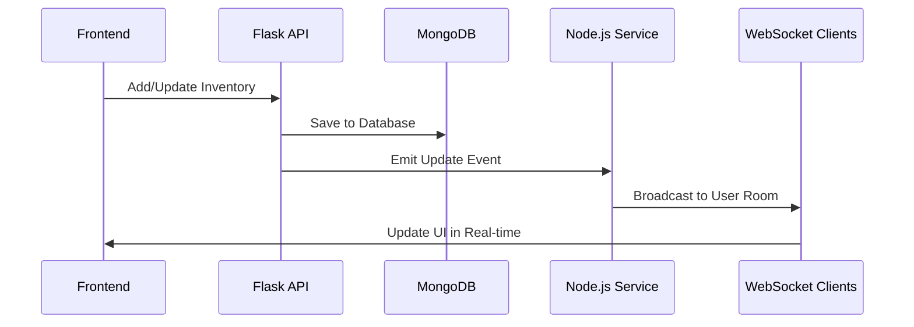

# AI Integration & Real-time Features Specification

## 🤖 AI Integration Architecture

### DeepSeek API Integration Strategy

#### 1. Product Categorization System
```javascript
// AI Categorization Flow
User Input → Product Details → DeepSeek API → Smart Category Assignment

// Example API Payload
{
  "product_name": "Organic Fuji Apples",
  "brand": "Fresh Farms",
  "description": "Fresh organic apples from local farm",
  "barcode_data": {
    "categories": "Fruits, Fresh Produce",
    "nutrition_facts": {...}
  }
}

// AI Prompt Template
const categorizationPrompt = `
Categorize this grocery product into the most appropriate category:

Product: ${productName}
Brand: ${brand}
Description: ${description}
Existing Categories: ${availableCategories}

Please respond with ONLY the most appropriate category from this list:
- Fruits & Vegetables
- Dairy & Eggs
- Meat & Seafood
- Bakery & Bread
- Pantry & Dry Goods
- Beverages
- Frozen Foods
- Snacks & Sweets
- Household & Cleaning
- Personal Care

Category: 
`;
```

#### 2. Expiry Prediction System
```javascript
// Expiry Prediction Flow
Product Type + Storage Conditions → AI Analysis → Predicted Expiry

// Example API Payload
{
  "product_type": "milk",
  "storage_location": "refrigerator",
  "opened_status": false,
  "purchase_date": "2024-01-15",
  "brand": "Organic Valley"
}

// AI Prompt Template
const expiryPrompt = `
Predict the typical expiry date for this product based on its type and storage conditions:

Product Type: ${productType}
Storage: ${storageLocation}
Opened: ${isOpened ? 'Yes' : 'No'}
Purchase Date: ${purchaseDate}

Based on common food safety guidelines and typical shelf life, provide:
1. Expected expiry date (YYYY-MM-DD format)
2. Confidence level (High/Medium/Low)
3. Storage recommendations

Response format:
Expected Expiry: YYYY-MM-DD
Confidence: High/Medium/Low
Recommendations: [storage tips]
`;
```

#### 3. Inventory Optimization
```javascript
// Smart Suggestions Flow
Current Inventory + User Preferences → AI Analysis → Recommendations

// AI Prompt Template
const optimizationPrompt = `
Based on the user's current inventory and preferences, provide smart suggestions:

Current Inventory:
${inventorySummary}

User Preferences:
- Dietary: ${dietaryRestrictions}
- Cooking Frequency: ${cookingFrequency}
- Household Size: ${householdSize}

Please provide:
1. Items approaching expiry that should be used soon
2. Recipe suggestions based on available ingredients
3. Shopping list recommendations for missing essentials
4. Storage optimization tips
`;
```

### Real-time Features Architecture

#### 1. WebSocket Implementation
```javascript
// Node.js Socket.io Configuration
const io = require('socket.io')(server, {
  cors: {
    origin: ["http://localhost:3000", "https://yourdomain.com"],
    methods: ["GET", "POST"]
  }
});

// Real-time Events
io.on('connection', (socket) => {
  console.log('User connected:', socket.id);
  
  // Join user-specific room for inventory updates
  socket.on('join-inventory', (userId) => {
    socket.join(`inventory-${userId}`);
  });
  
  // Real-time inventory updates
  socket.on('inventory-update', (data) => {
    // Broadcast to all connected clients in the same user room
    io.to(`inventory-${data.userId}`).emit('inventory-changed', data);
  });
  
  // Expiry notifications
  socket.on('subscribe-expiry', (userId) => {
    socket.join(`expiry-${userId}`);
  });
  
  socket.on('disconnect', () => {
    console.log('User disconnected:', socket.id);
  });
});
```

#### 2. Real-time Inventory Updates
```javascript
// Inventory Update Flow
Frontend Action → Flask API → MongoDB → Node.js Service → Real-time Broadcast

// Example Update Sequence
1. User adds product to inventory (Flask API)
2. Flask saves to MongoDB and emits event to Node.js service
3. Node.js broadcasts update to all connected clients for that user
4. Frontend receives update and refreshes UI in real-time
```

#### 3. Push Notifications System
```javascript
// Expiry Alert System
const checkExpiryAlerts = async () => {
  const expiringSoon = await Inventory.find({
    expiry_date: { 
      $lte: new Date(Date.now() + 7 * 24 * 60 * 60 * 1000), // 7 days from now
      $gte: new Date() 
    },
    status: 'active'
  }).populate('user_id').populate('product_id');
  
  expiringSoon.forEach(item => {
    // Send real-time notification
    io.to(`expiry-${item.user_id}`).emit('expiry-alert', {
      product: item.product_id.name,
      expiry_date: item.expiry_date,
      days_remaining: Math.ceil((item.expiry_date - new Date()) / (24 * 60 * 60 * 1000))
    });
  });
};

// Run every hour
setInterval(checkExpiryAlerts, 60 * 60 * 1000);
```

## 🔄 Real-time Data Flow

### Complete Real-time Architecture


### AI Service Integration Points

#### 1. Product Categorization Service
```javascript
// Node.js AI Service Route
app.post('/api/ai/categorize', async (req, res) => {
  try {
    const { productData } = req.body;
    
    const category = await categorizeProduct(productData);
    
    res.json({
      success: true,
      category: category,
      confidence: 'high' // Based on AI response analysis
    });
  } catch (error) {
    console.error('AI categorization error:', error);
    res.status(500).json({
      success: false,
      error: 'Categorization failed'
    });
  }
});

const categorizeProduct = async (productData) => {
  const prompt = createCategorizationPrompt(productData);
  
  const response = await fetch('https://api.deepseek.com/v1/chat/completions', {
    method: 'POST',
    headers: {
      'Authorization': `Bearer ${process.env.DEEPSEEK_API_KEY}`,
      'Content-Type': 'application/json'
    },
    body: JSON.stringify({
      model: 'deepseek-chat',
      messages: [{ role: 'user', content: prompt }],
      max_tokens: 50,
      temperature: 0.3
    })
  });
  
  const data = await response.json();
  return extractCategoryFromResponse(data.choices[0].message.content);
};
```

#### 2. Smart Inventory Analysis
```javascript
// Weekly Inventory Analysis
const analyzeInventory = async (userId) => {
  const inventory = await Inventory.find({ user_id: userId })
    .populate('product_id')
    .sort({ expiry_date: 1 });
  
  const analysisPrompt = createInventoryAnalysisPrompt(inventory);
  
  const response = await fetch('https://api.deepseek.com/v1/chat/completions', {
    method: 'POST',
    headers: {
      'Authorization': `Bearer ${process.env.DEEPSEEK_API_KEY}`,
      'Content-Type': 'application/json'
    },
    body: JSON.stringify({
      model: 'deepseek-chat',
      messages: [{ role: 'user', content: analysisPrompt }],
      max_tokens: 200,
      temperature: 0.5
    })
  });
  
  const data = await response.json();
  return parseAnalysisResults(data.choices[0].message.content);
};
```

## 🎯 Enhanced AI Features

### 1. Smart Recipe Suggestions
```javascript
// Recipe Suggestion Flow
Current Inventory → AI Analysis → Personalized Recipes

const recipeSuggestionPrompt = `
Based on the following inventory items, suggest 3 recipes:

Available Ingredients:
${ingredientsList}

User Preferences:
- Cooking Skill: ${cookingSkill}
- Time Available: ${cookingTime}
- Dietary: ${dietaryRestrictions}

Please provide:
1. Recipe name
2. Brief description
3. Main ingredients used
4. Estimated preparation time
5. Difficulty level
`;
```

### 2. Shopping List Optimization
```javascript
// Smart Shopping List
const shoppingListPrompt = `
Based on the user's inventory and consumption patterns, suggest items to purchase:

Current Inventory Status:
${inventoryStatus}

Recent Consumption:
${consumptionPatterns}

User Preferences:
- Budget: ${budgetRange}
- Store Preferences: ${preferredStores}
- Brand Preferences: ${brandPreferences}

Please provide a prioritized shopping list with:
1. Essential items needed
2. Suggested quantities
3. Estimated cost range
4. Store recommendations
`;
```

### 3. Nutritional Insights
```javascript
// Nutritional Analysis
const nutritionalPrompt = `
Analyze the nutritional balance of this inventory:

Inventory Items:
${inventoryWithNutrition}

Provide insights on:
1. Overall nutritional balance
2. Potential deficiencies
3. Healthier alternatives
4. Balanced meal suggestions
`;
```

## 🔧 Implementation Details

### AI Service Configuration
```javascript
// Node.js AI Service Configuration
const AI_CONFIG = {
  DEEPSEEK_API_URL: 'https://api.deepseek.com/v1',
  MAX_TOKENS: {
    CATEGORIZATION: 50,
    EXPIRY_PREDICTION: 100,
    RECIPE_SUGGESTIONS: 200,
    SHOPPING_LIST: 150
  },
  TEMPERATURE: {
    CATEGORIZATION: 0.3,    // More deterministic
    SUGGESTIONS: 0.5,       // Balanced creativity
    ANALYSIS: 0.7            // More creative
  },
  CACHE_TTL: 3600 // 1 hour cache for similar requests
};
```

### Real-time Performance Optimization
```javascript
// WebSocket Connection Management
const connectionManager = {
  maxConnectionsPerUser: 3,
  heartbeatInterval: 30000, // 30 seconds
  connectionTimeout: 60000, // 1 minute
  
  // Throttle updates to prevent flooding
  throttleInventoryUpdates: (userId, update) => {
    const key = `inventory-update-${userId}`;
    if (!throttleCache[key] || Date.now() - throttleCache[key] > 1000) {
      throttleCache[key] = Date.now();
      return true; // Allow update
    }
    return false; // Throttled
  }
};
```

### Error Handling & Fallbacks
```javascript
// AI Service with Fallbacks
const categorizeWithFallback = async (productData) => {
  try {
    // Try AI categorization first
    const aiCategory = await categorizeProduct(productData);
    return aiCategory;
  } catch (error) {
    console.warn('AI categorization failed, using rule-based fallback');
    
    // Rule-based fallback categorization
    return ruleBasedCategorization(productData);
  }
};

// Real-time Fallback Mechanism
const realTimeUpdateWithFallback = (userId, update) => {
  if (!isWebSocketConnected(userId)) {
    // Fallback to polling or store for later delivery
    storePendingUpdate(userId, update);
    return;
  }
  
  // Send real-time update
  io.to(`inventory-${userId}`).emit('inventory-changed', update);
};
```

## 📊 Monitoring & Analytics

### AI Performance Metrics
```javascript
const aiMetrics = {
  categorizationAccuracy: 0.0,
  responseTime: 0,
  successRate: 0.0,
  fallbackUsage: 0
};

// Track AI performance
const trackAIPerformance = (endpoint, success, responseTime, usedFallback = false) => {
  aiMetrics.responseTime = (aiMetrics.responseTime + responseTime) / 2;
  
  if (success) {
    aiMetrics.successRate = ((aiMetrics.successRate * 99) + 1) / 100;
  } else {
    aiMetrics.successRate = (aiMetrics.successRate * 99) / 100;
  }
  
  if (usedFallback) {
    aiMetrics.fallbackUsage = ((aiMetrics.fallbackUsage * 99) + 1) / 100;
  }
};
```

### Real-time Connection Analytics
```javascript
const connectionAnalytics = {
  activeConnections: 0,
  messagesPerMinute: 0,
  averageLatency: 0,
  errorRate: 0.0
};
```

This enhanced specification provides comprehensive details for implementing robust AI integration and real-time features in the GrocerStock application, including error handling, performance optimization, and advanced AI capabilities.