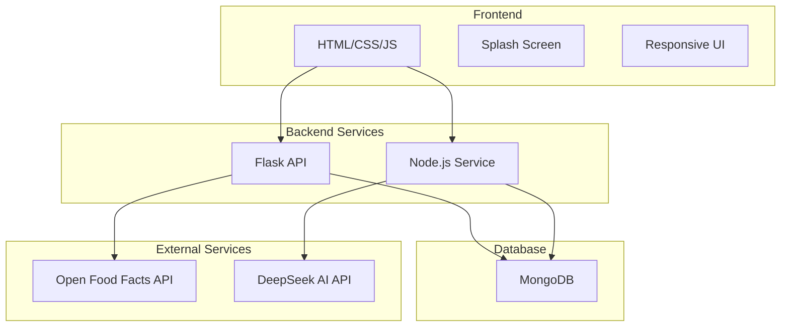
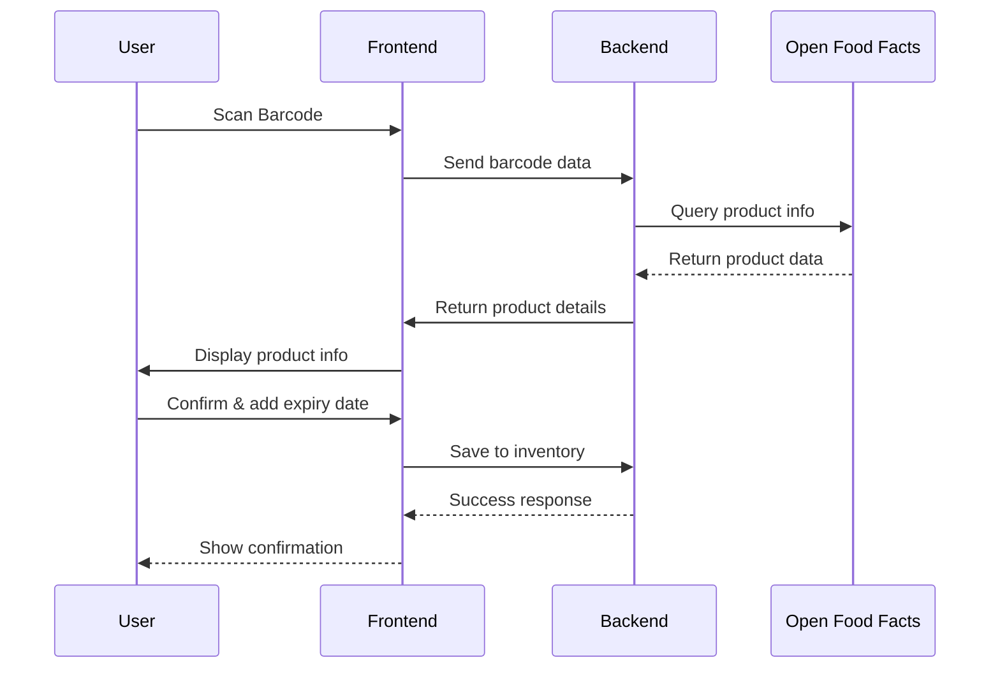
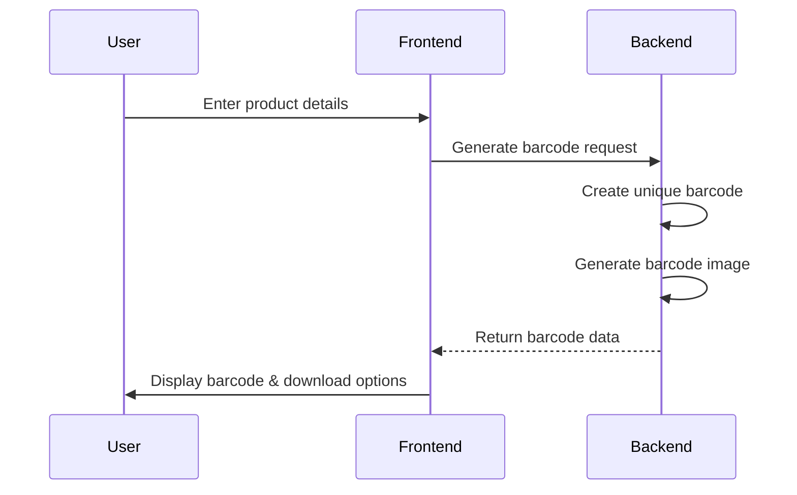

# GrocerStock: Smart Inventory Manager - Project Architecture

## 🎯 Project Overview
A dynamic, full-stack application for managing grocery and vegetable inventory with automated data entry and barcode functionality.

## 🏗️ Technical Architecture

### Core Technology Stack
- **Frontend**: HTML5, CSS3, JavaScript (ES6+)
- **Backend**: Python Flask (primary API)
- **Auxiliary Service**: Node.js (real-time features)
- **Database**: MongoDB (NoSQL)
- **Containerization**: Docker & Docker Compose
- **External APIs**: Open Food Facts API, DeepSeek AI API

### System Architecture Diagram


## 📁 Project Structure
```
grocerstock/
├── frontend/
│   ├── index.html
│   ├── css/
│   │   ├── main.css
│   │   ├── animations.css
│   │   └── responsive.css
│   ├── js/
│   │   ├── app.js
│   │   ├── auth.js
│   │   ├── scanner.js
│   │   ├── inventory.js
│   │   └── barcode-generator.js
│   └── assets/
│       ├── images/
│       └── icons/
├── backend/
│   ├── flask_app/
│   │   ├── app.py
│   │   ├── models.py
│   │   ├── routes/
│   │   │   ├── auth.py
│   │   │   ├── products.py
│   │   │   ├── inventory.py
│   │   │   └── barcode.py
│   │   ├── utils/
│   │   │   ├── barcode_utils.py
│   │   │   └── image_processing.py
│   │   └── requirements.txt
│   └── node_service/
│       ├── package.json
│       ├── server.js
│       ├── routes/
│       │   ├── realtime.js
│       │   └── ai.js
│       └── utils/
│           └── websocket.js
├── docker/
│   ├── Dockerfile.flask
│   ├── Dockerfile.node
│   └── docker-compose.yml
├── database/
│   └── init-mongo.js
└── docs/
    ├── API.md
    └── SETUP.md
```

## 🗄️ Database Schema Design

### Users Collection
```javascript
{
  _id: ObjectId,
  username: String,
  email: String,
  password_hash: String,
  created_at: Date,
  last_login: Date,
  preferences: {
    theme: String,
    notifications: Boolean
  }
}
```

### Products Collection
```javascript
{
  _id: ObjectId,
  barcode: String,           // UPC/EAN code
  name: String,
  brand: String,
  category: String,
  subcategory: String,
  image_url: String,         // URL to product image
  nutritional_info: Object,  // From Open Food Facts
  created_at: Date,
  updated_at: Date
}
```

### Inventory Collection
```javascript
{
  _id: ObjectId,
  user_id: ObjectId,
  product_id: ObjectId,
  quantity: Number,
  expiry_date: Date,
  added_date: Date,
  location: String,          // e.g., "pantry", "fridge", "freezer"
  notes: String,
  status: String             // "active", "expired", "consumed"
}
```

### Generated Barcodes Collection
```javascript
{
  _id: ObjectId,
  user_id: ObjectId,
  product_name: String,
  custom_barcode: String,     // Generated unique code
  category: String,
  weight: String,
  created_at: Date,
  image_path: String          // Path to generated barcode image
}
```

## 🔧 API Endpoints Design

### Flask API Routes
- `POST /api/auth/register` - User registration
- `POST /api/auth/login` - User login
- `GET /api/products/search` - Search products by barcode/name
- `POST /api/products` - Add new product
- `GET /api/inventory` - Get user inventory
- `POST /api/inventory` - Add item to inventory
- `PUT /api/inventory/:id` - Update inventory item
- `DELETE /api/inventory/:id` - Remove inventory item
- `POST /api/barcode/generate` - Generate custom barcode
- `GET /api/barcode/:id/image` - Get barcode image

### Node.js Service Routes
- `GET /api/realtime/inventory` - WebSocket for real-time updates
- `POST /api/ai/categorize` - AI-powered product categorization
- `POST /api/ai/suggestions` - Product suggestions based on inventory

## 🎨 UI/UX Design Specifications

### Color Palette
- **Primary**: #FF9900 (Vibrant Orange)
- **Secondary**: #FFFFFF (Clean White)
- **Accent**: #333333 (Dark Gray)
- **Success**: #28A745 (Green)
- **Warning**: #FFC107 (Amber)
- **Error**: #DC3545 (Red)

### Key UI Components
1. **Splash Screen**: Animated logo with loading indicator
2. **Login/Signup**: Clean forms with validation
3. **Dashboard**: Inventory overview with expiry alerts
4. **Scanner Interface**: Camera access with scanning overlay
5. **Product Entry**: Manual form with expiry date picker
6. **Barcode Generator**: Input form with preview and download options

### Animations & Transitions
- Smooth page transitions
- Micro-interactions on buttons and cards
- Loading spinners and progress indicators
- Card flip animations for product details
- Hover effects and pulse animations

## 🔄 Workflow Diagrams

### Product Scanning Workflow


### Barcode Generation Workflow


## 🐳 Docker Configuration

### Services
- **web-flask**: Python Flask application (port 5000)
- **web-nodejs**: Node.js service (port 3000)
- **mongo**: MongoDB database (port 27017)
- **nginx**: Reverse proxy (port 80)

### Network
All services connected via `grocerstock-network` for inter-service communication.

## 🔐 Security Considerations

- Password hashing with bcrypt
- JWT-based authentication
- Input validation and sanitization
- CORS configuration for frontend-backend communication
- Secure file upload handling for product images

## 📱 Responsive Design Breakpoints
- Mobile: < 768px
- Tablet: 768px - 1024px
- Desktop: > 1024px

## 🚀 Deployment Strategy
- Docker containers for all services
- Environment-based configuration
- Health checks and monitoring
- Logging and error tracking

This architecture provides a scalable foundation for the GrocerStock application with clear separation of concerns and modern development practices.